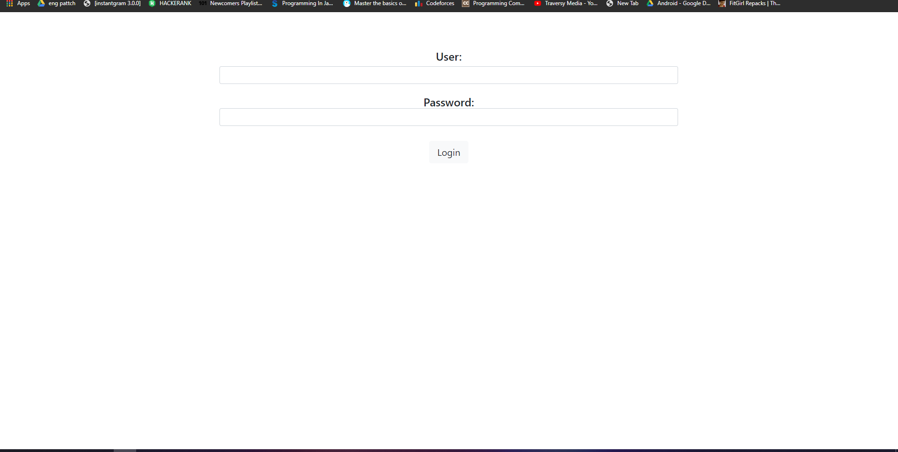
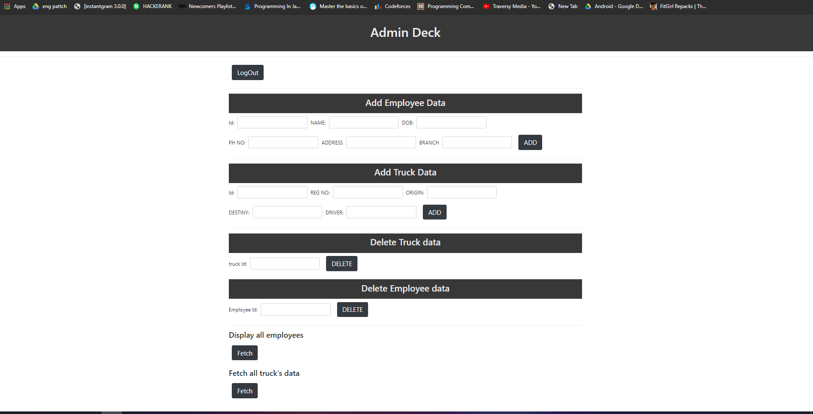
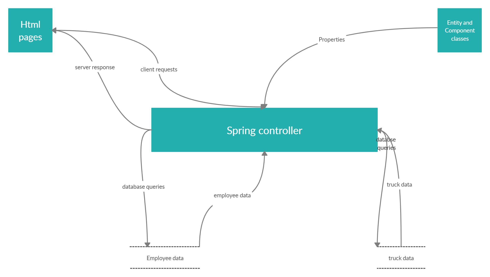
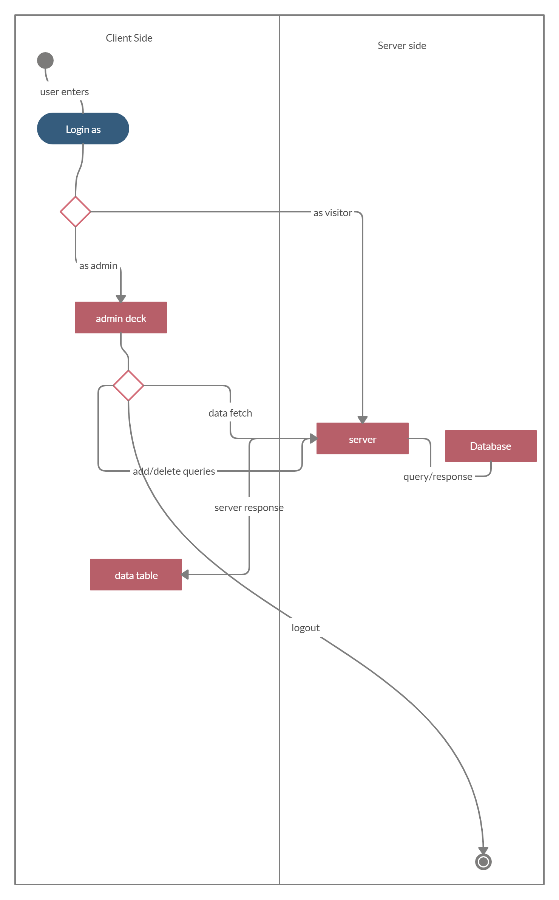

# Qship

Qship is a simple web app to keep track of employees as well as trucks with their routes.
visitors simply can view the truck records.

# Qship application iverview

## index
the index page , the first page or the entrance to qship, allows you to enter as a visitor or an admin. being a visitor only means you can view the truck data.
other information is restricted to admin

## login
to login as admin use the following credentials
user: admin
password:iamadmin

## admion deck
deck consists of various forms to add or delete data from employee as well as truck database.
from here you can view the employee as well as trucks.Enter Data in respective fields and click on the button that follows.
the logout button at the top takes you out of the admin deck.

## Data Flow Diagram
Following diagram shows the data flow in qship web app as diagramatic representation.

## UML Diagram
Following is the uml diagram of qship

