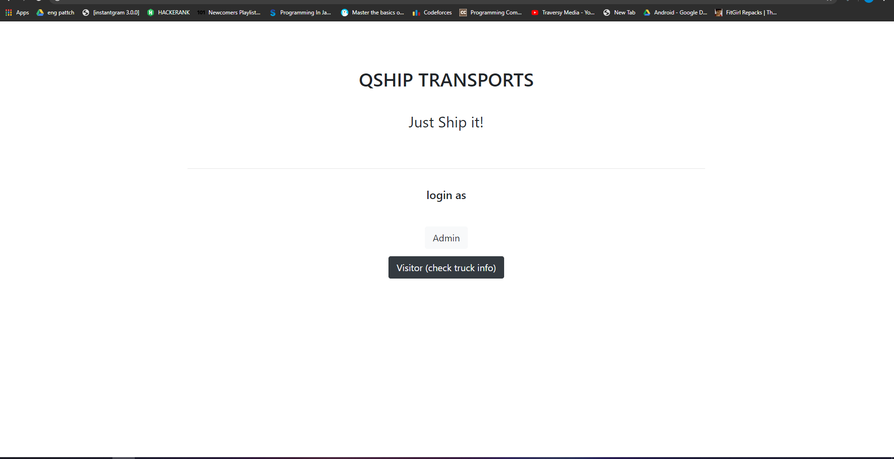

# Qship

Qship is a simple web app to keep track of employees as well as trucks with their routes.
visitors simply can view the truck records.

# Spring boot
Spring Boot is a project that is built on the top of the Spring Framework. It provides an easier and faster way to set up, configure, and run both simple and web-based applications.

It is a Spring module that provides the RAD (Rapid Application Development) feature to the Spring Framework. It is used to create a stand-alone Spring-based application that you can just run because it needs minimal Spring configuration.

## index
the index page allows you to enter as a visitor or an admin. being a visitor only means you can view the truck data.
other information is restricted to admin

## login
to login as admin use the following credentials
user: admin
password:iamadmin

## admion deck
deck consists of various forms to add or delete data from employee as well as truck database.
from here you can view the employee as well as trucks.Enter Data in respective fields and click on the button that follows.
the logout button at the top takes you out of the admin deck.

